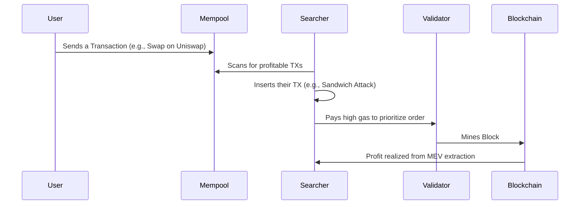
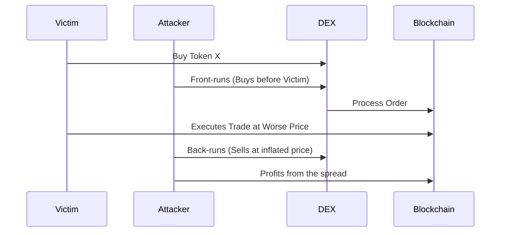

 #Eth #Mev #secruity 
 

# What is MEV

Maximal extractable value  

- A value that can be extracted by recording including or censoring a transaction. 
- The way transactions are processed in the blockchain.

flowchart LR

# MEV Sandwich Attack

j